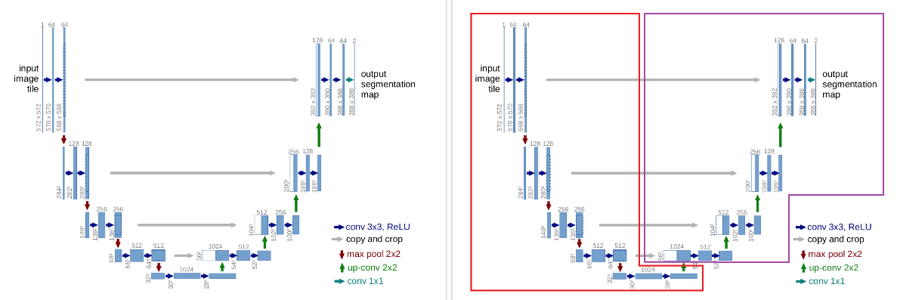
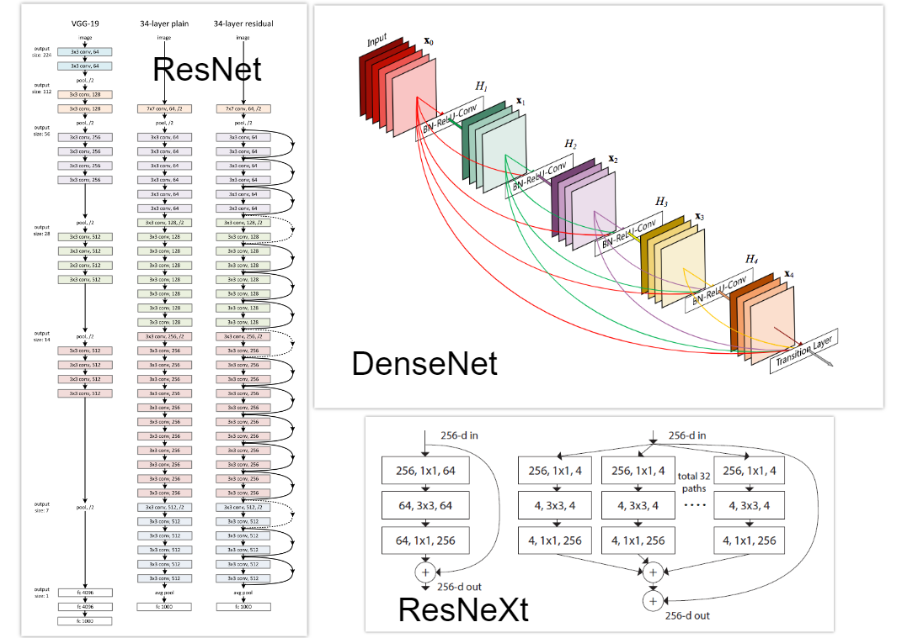
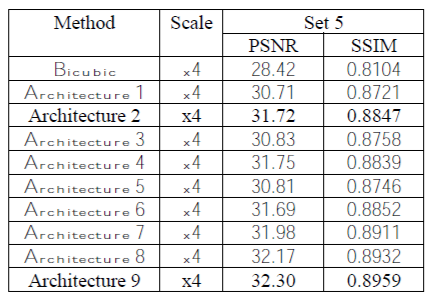
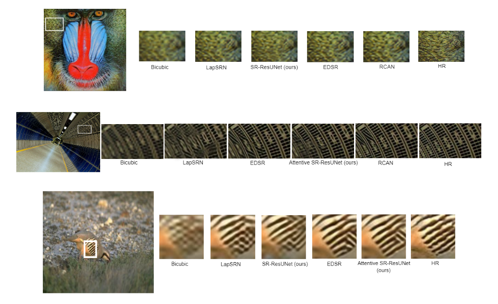
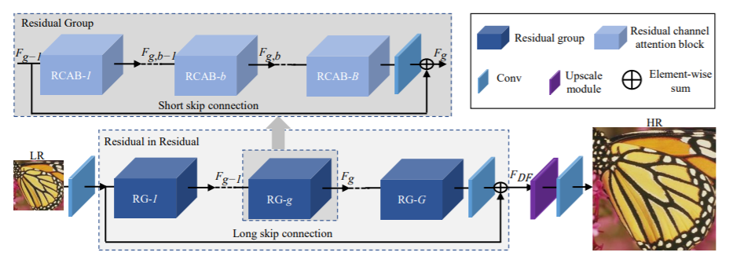
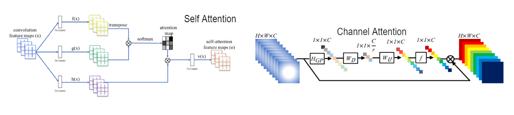
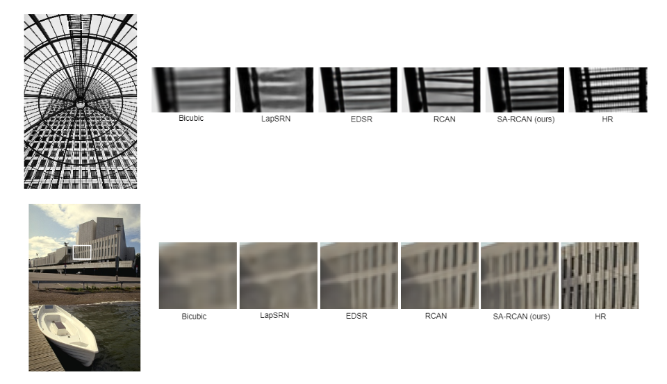
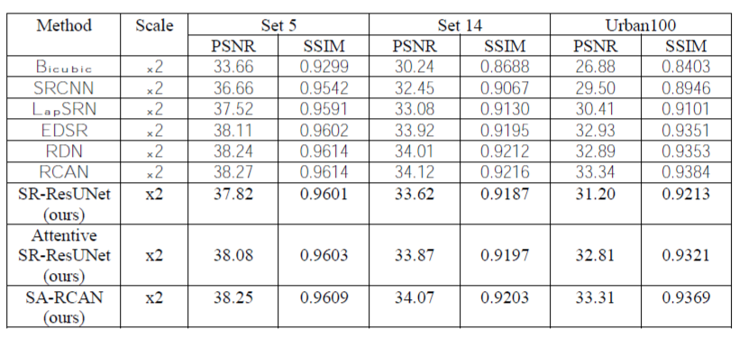
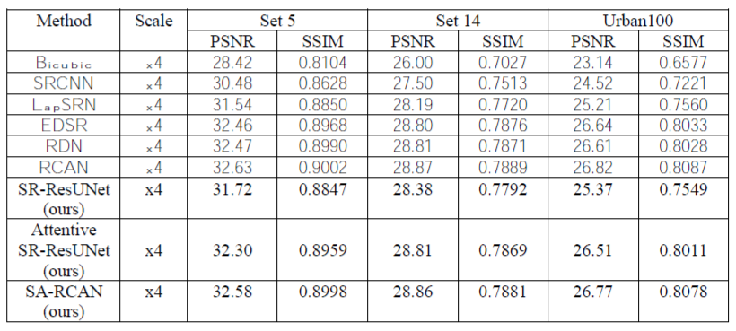

<h1>NVIDIA Research Internship</h1>
<h3>Dhruv Sabharwal</h3>
<h3>Megh Makwana</h3>
<h2>Project Domain: Single Image Super-Resolution</h2>
In this project we have developed novel architectures for image super-resolution using U-Nets, modern up-sampling layers and attention mechanisms, achieving high PSNR, SSIM and perceptual scores. 

<h2> Our Contributions </h2>
<ul>
  <li> We develop a large number of U-Net based models for image super-resolution. We then compare these models and present our results as well as observations.</li>
  <li> We show that we can reduce the size of RCAN by upto 40% and still get comparable results by employing self-attention in tandem with channel attention. Self-attention helps in modeling long-range dependencies and leads to smoother (and more natural) transition of objects in the SR image.</li>
</ul>

In the upcoming sections, we first talk about the groundwork that was done to gain the required knowledge for solving the problem statement. After that, this readme is divided into 2 parts, each describing a different approach we took to solve this problem. 

<h1>Groundwork</h1>
Machine learning has gone through great advances in the last decade fuelled by the easy availability of GPUs and the exponential increase in interest in this field. Naturally, some researchers have developed models which have changed the landscape forever. We implemented some of these famous models. 

<ol>
  <li><b>ResNet:</b> We implemeted several types of ResNet architectures including ResNet34, ResNet50, ResNeXt and ResNeSt.</li>
  <li><b>SAGAN:</b> The self attention module of SAGAN was implemented. This attention mechanism has been widely adopted for several computer vision tasks.</li>
  <li><b>Spectral Normalization:</b> Spectral Normalization is a weight normalization technique to stabilize the training of deep models, specially GANs. They are also used in tandem with attention mechanisms to provide stability and lead to output images of better quality. In spectral normalization, Lipschitz constant is the only hyper-parameter to be tuned, and the algorithm does not require intensive tuning of this hyper-parameter for satisfactory performance.</li>
  <li><b>U-Net:</b> U-Nets have been used for biomedial image segmentation, and have produced great results. They form a major component of our final models and hence a fair amount of time was spent in understanding their functioning in detail and building U-Net style mdoels suitable for tackling our problem statement.</li>
  <li><b>Activation Functions:</b> Recently, a large number of advanced activation functions have also been developed which have produced promising results. We implemented several of these activation functions, which were later used in our experimentation. Some of the activation functions were: Swish, ELiSH, Mila, SineReLU, Mish, Aria-2, SiLU, etc.</li>
  <li><b>Perceptual Loss Functions:</b> Perceptual loss functions have found great success in real-time style transfer and image super-resolution. We developed different types of perceptual loss functions combining it's three main components, namely content loss, style loss and total variation regularization. All of these loss functions were used during experimentation, to find the ones which led to the most perceptually pleasing results.</li>
</ol>

<h1>Part 1 - U-Nets</h1>
U-Nets have been used in the past for biomedical image segmentation. They consist of a contracting path and a symmetric expanding path. 
 
For our purpose we have split the unet into 2 parts - the decoder and the encoder. We use a pretrained resnet model as the encoder and train only the decoder. In the above image, the red box shows the encoder and the purple box shows he decoder. The pretrained encoder is adept at feature extraction and the decoder then converts these features into the HR image.  
<h3>Encoder</h3>
We have experimented with 3 different resnet models as encoders: 
<ol>
  <li><b>ResNet-34</b></li>
  <li><b>ResNet-50</b></li>
  <li><b>ResNeXt</b></li>
</ol>
 
ResNets make use of skip connections which act like identity mappings and enable us to implement deeper networks. 
<h3>Decoder</h3>
We have experimented with 3 main choices for the decoder: 

<ol>
  <li><b>Simple ResNet Architecture -</b> this is a mirror image of the architecture used as the encoder.</li>
  <li><b>DenseNet Architecture -</b> In these models we use residual connections from all preceding layers to all successive layers. They help in transferring maximum information from previous layers to successive layers and have been shown to perform very well for several tasks like image classification and object detection. </li>
  <li><b>Attention mechanisms -</b> Built on top of the ResNet and DenseNet architectures, attention mehcanisms, both channel attention as well as spatial attention have been implemented.</li>
</ol>

In total we have implemented 9 models. The details about the encoder and decoder used are provided below. This is followed by a comparision of these models based on how they performed on the Set5 benchmark dataset. All models are trained for x2 and x4 super-resolution using the Div2k dataset. It is important to note that in all the ResNet encoders the final average pool and fully connected layers are dropped since our aim is to just extract the image features using the encoder. 
<ol>
  <li><b>Architecture 1:</b> The encoder used was a ResNet-34. The decoder is a mirror image of the encoder.</li>
  <li><b>Architecture 2:</b> The encoder used was a ResNet-34. The decoder is a dense net with similar number of layers as the encoder.</li>
  <li><b>Architecture 3:</b> The encoder used was a ResNet-50. The decoder is a mirror image of the encoder.</li>
  <li><b>Architecture 4:</b> The encoder used was a ResNet-50. The decoder is a dense net with similar number of layers as the encoder.</li>
  <li><b>Architecture 5:</b> The encoder used was a ResNeXt-50. The decoder is a mirror image of the encoder.</li>
  <li><b>Architecture 6:</b> The encoder used was a ResNeXt-50. The decoder is a dense net with similar number of layers as the encoder.</li>
  <li><b>Architecture 7:</b> The encoder used was a ResNet-34. The decoder is a denseNet coupled with channel attention blocks (with skip connections) at the end of each layer.</li>
  <li><b>Architecture 8:</b> The encoder used was a ResNet-34. The decoder is a denseNet coupled with spatial attention blocks (with skip connections) at the end of each layer.</li>
  <li><b>Architecture 9:</b> The encoder used was a ResNet-34. The decoder is a denseNet coupled with channel as well as spatial attention blocks (with skip connections) at the end of each layer.</li>
</ol>
<b>Observations:</b> ResNet34, ResNet50 and ResNext50 models produced HR images of similar perceptual qualtity. For this reason when we started using attention mechanisms, we stuck to the ResNet34 architecture for the encoder as it had the least number of parameters. When we added attention mechanisms into the mix, we got significantly better results. We also observed that the benefits produced by channel and spatial attention are additive and using both of them together helped us achive very good results. Architecture 9 above produced the best results. Architecture 2 produced the second best results. 

<h2>Training Details</h2>
<b>Dataset:</b> All models are trained on the Div2k dataset on images of size 48x48. The images are cropped at random from the Div2k dataset. We also use augmentation strategies (horizontal and vertical rotations) to increase the size of the dataset. 
<b>Activation Functions:</b> We have experimented with several activation functions, including ReLU, LeakyReLU, PReLU and Mish. The LeakyReLU activation function gave us the best results. 
<b>Normalization layers:</b> We have experimented with 3 normalization layers, Instance normalization, Batch normalization and Spectral normalization. We also tried avoiding the use of normalization layers, however that led to loss of perceptual quality. Instance normalization worked best with the convolution layers and spectral normalization worked best with the attention blocks. 
<b>Initialization Strategies:</b> Several initialization strategies have been experimented with including Kaiming initialization, Xavier initialization and Random initialization. Kaiming Uniform initialization worked best for our models. 
<b>Loss Functions:</b> We have experimented with perceptual losses as well as the usual L1 and L2 loss functions. The perceptual loss included content loss, style loss and total variation regularization components. A mixture of perceptual loss and L1 loss were used to train the final models in Part 1 and only L1 loss was used for the models in Part 2. 
<b>Upsampling Mechanisms:</b> Initially we tried using deconvolution layers for this purpose. However they led to artifacts in the final HR images. We then used the pixel shuffle upsampling strategy described in <a href="https://arxiv.org/ftp/arxiv/papers/1707/1707.02937.pdf">this</a> paper. This led to much more natural looking images without any artifacts. 
<b>Discriminative Learning Rates and Gradual Unfreezing:</b> Both of these strategies have been widely used when fine-tuning pre-trained models. As we use a pretrained encoder, we keep it fixed for the first few epochs, only allowing it's weights to update after 30 epochs (gradual unfreezing). We also employ discriminative learning rates, using a much smaller learning rate for the encoder (1e-5) as compare to the decoder (1e-4). This helps to prevent catastrophic forgetting of the encoder weights. Both of these learning rates are halved every 30 epochs. 

<h2>Quantitative Results</h2>

<b>Note:</b> Architecture 9 gave us the best results among the attention based models. Architecture 2 gave us the best results among the non-attention models relative to the number of parameters and inference time. In the upcoming sections we refer to Architecture 2 as <b>SR-ResUNet</b> and Architecture 9 as <b>Attentive SR-ResUNet</b>. 

<h2>Visual Results</h2>

<h1>Part 2 - Self Attention RCAN</h1>
In this part we use the RCAN model as the baseline. RCAN consists of 10 Residual Groups (RGs), with 20 RCAB blocks each. 

Each RCAB block consists of a channel attention layer. In total, the RCAN model has 200 RCAB blocks making it a very deep network. We try to use self attention along with channel attention in the RCAN model. Also, we make the baseline RCAN model lightweight by limiting the Residual Groups to 6. Each RCAB block has a channel attention layer followed by a self attention layer. In the self attention layer we use reduction of 16 and use a maxpool operator to limit training images to size 24x24. We call our model <b>SA-RCAN</b>. 

<h2>Visual Results</h2>

<h2>Overall Quantitative Results</h2>

<h2>Acknowledgements</h2>
<ul>
  <li><a href="https://arxiv.org/abs/1505.04597">U-Net</a> </li>
  <li><a href="https://arxiv.org/abs/1603.08155">Perceptual Loss</a></li>
  <li><a href="https://arxiv.org/ftp/arxiv/papers/1707/1707.02937.pdf">Pixel Shuffle Upsampling</a></li>
  <li><a href="https://arxiv.org/abs/1512.03385">ResNet</a></li>
  <li><a href="https://arxiv.org/abs/1611.05431">ResNeXt</a></li>
  <li><a href="https://arxiv.org/abs/1805.08318">Self Attention - SAGAN</a></li>
  <li><a href="https://arxiv.org/abs/1807.02758">Channel Attention - RCAN</a></li>
  <li><a href="https://arxiv.org/abs/1802.05957">Spectral Normalization</a></li>
  <li>Code for part 2 is built on <a href="https://github.com/yulunzhang/RCAN">RCAN (PyTorch)</a>. We thank the authors for sharing their code.</li>
</ul>
